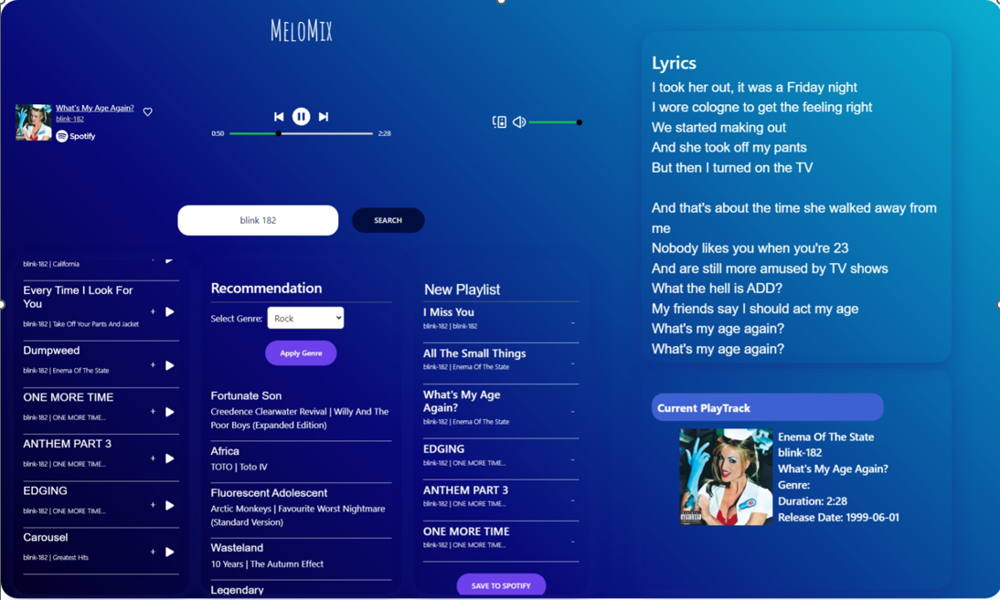

# MeloMix powered by SpotifyAPI and Musixmatch API

## 

## Features

- Play and Save playlist using Spotify API
  Search and Filter by Genre tracks using Spotify API
- Generate Lyrics using Musixmatch API

## IDE Used

- Visual Studio Code

## Technologies Used

Front-End:

- Spotify API
- Musixmatch API
- Fontawesome Library
- React

## Installations

1. Clone the repository
2. Navigate to the project directory
3. Install dependencies for client side

## Usage

1. Start the client
2. Open a web browser and navigate to http://localhost:3000
3. Login your spotify credentials
4. Search, Play tracks and save playlist to view on your spotify app.

## Contributor

- [Michael Pinsonneault](https://github.com/Mikepin23)
  

- [Sangkyu Kim](https://github.com/SangKyu-Kim01)
  

